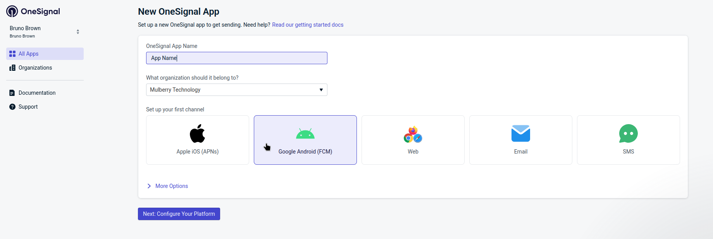
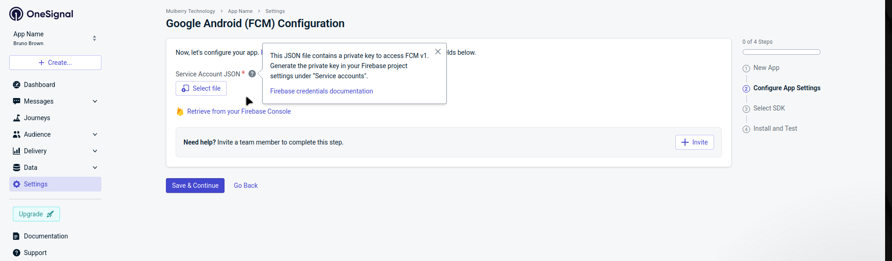
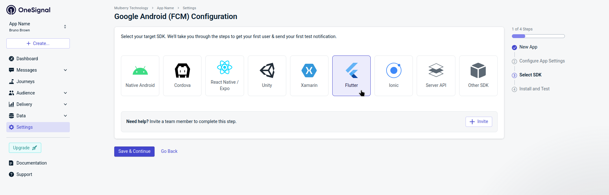
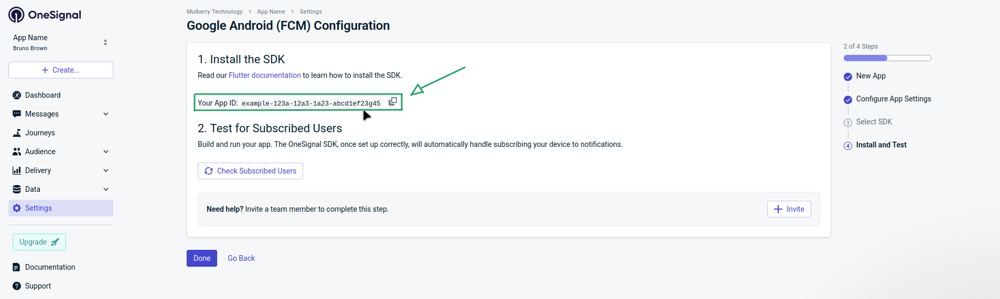

<h1 align="center">Flet OneSignal</h1>

<p align="center"></p>

**OneSignal SDK integration for Flet applications.**

Flet OneSignal is an extension that integrates the [OneSignal Flutter SDK](https://documentation.onesignal.com/docs/en/flutter-sdk-setup) with [Flet](https://flet.dev) applications. It provides a complete Python API for:

- **[Push Notifications](guide/notifications.md)** — send and receive on iOS and Android ([OneSignal Docs](https://documentation.onesignal.com/docs/en/push))
- **[In-App Messages](guide/in-app-messages.md)** — targeted messages within your app ([OneSignal Docs](https://documentation.onesignal.com/docs/en/in-app-messages-setup))
- **[User Management](guide/user-management.md)** — identity, tags, aliases, email, SMS ([OneSignal Docs](https://documentation.onesignal.com/docs/en/users))
- **[Location](guide/location.md)** — geo-targeted messaging ([OneSignal Docs](https://documentation.onesignal.com/docs/en/location-opt-in-prompt))
- **[Outcomes](guide/outcomes.md)** — track actions and conversions ([OneSignal Docs](https://documentation.onesignal.com/docs/en/custom-outcomes))
- **[Live Activities](guide/live-activities.md)** — iOS real-time updates (iOS 16.1+) ([OneSignal Docs](https://documentation.onesignal.com/docs/en/live-activities))
- **[Privacy & Consent](guide/privacy-consent.md)** — GDPR compliance ([OneSignal Docs](https://documentation.onesignal.com/docs/en/handling-personal-data))
- **[Debugging](guide/debugging.md)** — log levels and error handling

## Requirements

| Component | Minimum Version |
|-----------|-----------------|
| Python    | 3.10+           |
| Flet      | 0.80.x+         |

| Platform    | Minimum Version          | Notes                          |
|-------------|--------------------------|--------------------------------|
| **iOS**     | 12.0+                    | Requires Xcode 14+             |
| **Android** | API 24 (Android 7.0)+    | Requires `compileSdkVersion 33+` |

## Installation

### Step 1: Install the Package

```bash
# Using UV (Recommended)
uv add flet-onesignal

# Using pip
pip install flet-onesignal

# Using Poetry
poetry add flet-onesignal
```

### Step 2: Configure pyproject.toml

```toml
[project]
name = "my-flet-app"
version = "1.0.0"
requires-python = ">=3.10"

dependencies = [
    "flet>=0.80.5",
    "flet-onesignal>=0.4.0",
]

[tool.flet.app]
path = "src"
```

### Step 3: OneSignal Dashboard Setup (Android)

1. Create an account at [OneSignal.com](https://onesignal.com), then click **+ Create** > **New App**.

2. Enter your **App Name**, select the organization, choose **Google Android (FCM)** as the channel, and click **Next: Configure Your Platform**.

    

3. Upload your **Service Account JSON** file. To generate it, go to the [Firebase Console](https://console.firebase.google.com) > **Project Settings** > **Service accounts** > **Generate new private key**. See the [OneSignal Android credentials guide](https://documentation.onesignal.com/docs/en/android-firebase-credentials) for detailed instructions. Click **Save & Continue**.

    

4. Select **Flutter** as the target SDK, then click **Save & Continue**.

    

5. Copy the **App ID** displayed on the screen and click **Done**. You will use this ID in your Flet app.

    

### Step 4: iOS Configuration

1. Enable **Push Notifications** capability in Xcode
2. Enable **Background Modes** > Remote notifications
3. Add your APNs certificate to the OneSignal dashboard

## Quick Start

```python
import flet as ft
import flet_onesignal as fos

ONESIGNAL_APP_ID = "xxxxxxxx-xxxx-xxxx-xxxx-xxxxxxxxxxxx"


async def main(page: ft.Page):
    page.title = "My App"

    # Initialize OneSignal
    onesignal = fos.OneSignal(
        app_id=ONESIGNAL_APP_ID,
        log_level=fos.OSLogLevel.DEBUG,
    )

    # Add to page services (required for Flet 0.80.x)
    page.services.append(onesignal)

    # Request notification permission
    permission_granted = await onesignal.notifications.request_permission()
    print(f"Notification permission: {permission_granted}")

    # Identify the user
    await onesignal.login("user_12345")

    page.add(ft.Text("OneSignal is ready!"))


if __name__ == "__main__":
    ft.run(main)
```

!!! note
    `OneSignal` is a **service**, not a visual control. You must add it using
    `page.services.append(onesignal)` — **not** `page.overlay.append(onesignal)`.

## Architecture

The SDK follows a modular architecture that mirrors the official OneSignal SDK:

```
fos.OneSignal
│
├── .debug              # Logging and debugging
├── .user               # User identity, tags, aliases, email, SMS
├── .notifications      # Push notification management
├── .in_app_messages    # In-app message triggers and lifecycle
├── .location           # Location sharing (optional)
├── .session            # Outcomes and analytics
└── .live_activities    # iOS Live Activities (iOS 16.1+)
```

Each module provides focused functionality and can be accessed as a property of the main `OneSignal` instance.

## Example App

A complete example demonstrating all features is available in the [`examples/flet_onesignal_example`](https://github.com/brunobrown/flet-onesignal/tree/main/examples/flet_onesignal_example) directory. It includes pages for each module — login, notifications, tags, aliases, in-app messages, location, session outcomes and more — built with Flet's declarative UI.

To run:

```bash
cd examples/flet_onesignal_example
uv sync
uv run python src/main.py
```

---

## Contributing

Contributions and feedback are welcome!

1. Fork the [repository](https://github.com/brunobrown/flet-onesignal)
2. Create a feature branch
3. Submit a pull request with a detailed explanation

For bugs or suggestions, [open an issue](https://github.com/brunobrown/flet-onesignal/issues). Join the community on [Discord](https://discord.gg/dzWXP8SHG8).

---

## Support the Project

If you find this project useful, consider giving it a [star on GitHub](https://github.com/brunobrown/flet-onesignal) and supporting its development:

<a href="https://www.buymeacoffee.com/brunobrown">

</a>

[:fontawesome-brands-github: GitHub](https://github.com/brunobrown) · [:fontawesome-brands-x-twitter: X](https://x.com/BrunoBrown86) · [:fontawesome-brands-linkedin: LinkedIn](https://linkedin.com/in/bruno-brown-29418167/)

---

## Try **flet-onesignal** today and enhance your Flet apps with push notifications!

---

<p align="center"></p>
<p align="center"><a href="https://www.bible.com/bible/116/PRO.16.NLT">Commit your work to the LORD, and your plans will succeed. Proverbs 16:3</a></p>
